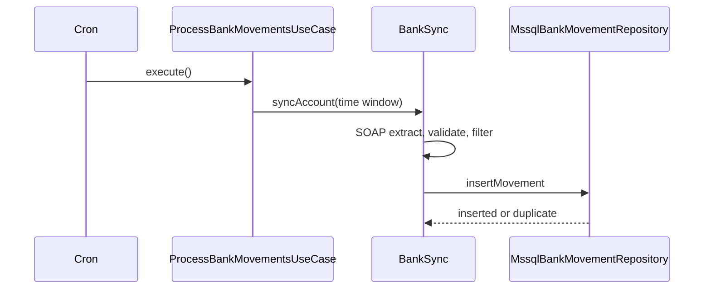
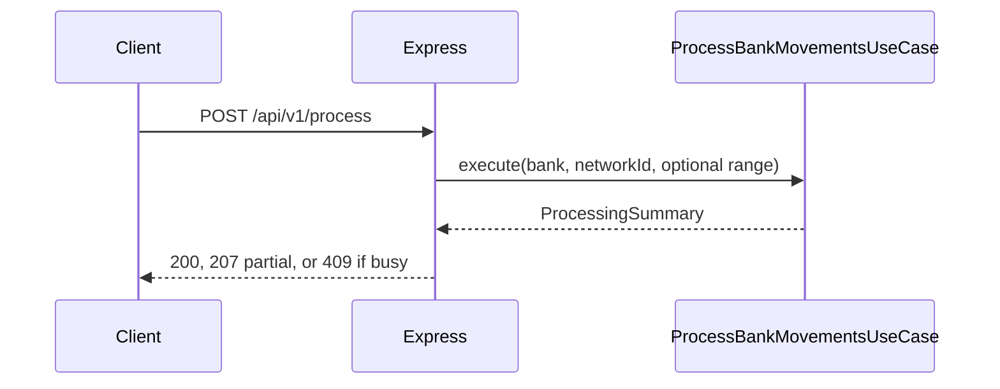
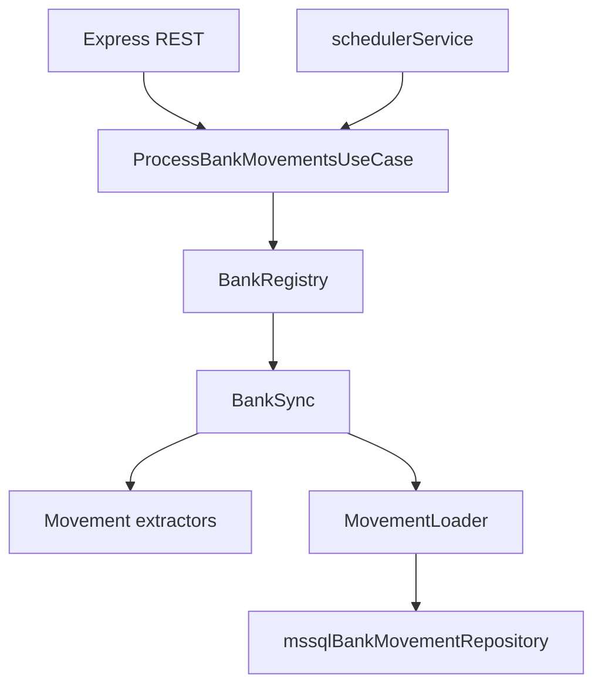

# CANIAS Bank Movement Integration Service

Node.js 22 service that pulls account movements from **VakifBank** and **Ziraat Bank** over SOAP, normalizes them, applies business rules, and inserts into CANIAS **Microsoft SQL Server**. Runs on a cron schedule or via REST. Duplicate rows are detected and skipped (idempotent inserts).

JavaScript only — no build step. Entry point: `src/server.js`.

**Scope:** SOAP → MSSQL sync only. CANIAS consumes `BANK_MOVEMENTS`; there is no movement list API.

**Core path:** `Scheduler` or `POST /process` → `ProcessBankMovementsUseCase` → `BankSync` → SOAP + parse → `MovementLoader` → INSERT.

## How processing works

### Scheduled run



The query window is: **now − `DATA_EXTRACTION_DURATION_MINUTES` − `QUERY_OVERLAP_MINUTES`**, in the configured timezone. Only one run is allowed at a time (in-process lock). A second trigger logs a warning and skips.

### Manual run



Optional body: `bank`, `networkId`, `startDateTime`, `endDateTime` (ISO-8601). Manual range is capped by `MAX_MANUAL_QUERY_RANGE_HOURS`.

### Component overview



**Patterns**

- **Extractor** — per bank: SOAP HTTP call + XML parse → domain movements (`ZiraatExtractor`, `VakifBankExtractor`).
- **Loader** — shared validate, credit filter, MSSQL insert (`MovementLoader`).
- **BankSync** — `syncAccount`: extract then `persist`.
- **BankRegistry** — resolves `getSync(bankType)` / `getExtractor(bankType)`.

## Project layout

```
config/
migrations/
src/
  application/            # use case + in-process run state
  banks/
  domain/                 # applicationErrors.js, parsers.js
  http/                   # REST routes, controllers, middleware
  logger.js
  mssqlBankMovementRepository.js
  schedulerService.js
  services.js              # IntegrationServices (version, config, fetch-movements)
  app.js
  server.js
tests/                    # *.js specs + testFixtures/ + setup.js
```

### Bank module (`src/banks/`)

| File | Role |
|------|------|
| `ziraat/ziraatMovementExtractor.js` | Ziraat SOAP fetch and parse |
| `vakifBank/vakifBankMovementExtractor.js` | VakifBank SOAP fetch and parse |
| `movementLoader.js` | Validate, filter, insert |
| `bankSync.js` | Extract + persist per account |
| `index.js` (`BankRegistry`) | Wire banks for the use case |
| `common/soapHttpClient.js`, `soapXml.js` | Shared SOAP HTTP and XML helpers |

**Supported banks**

| Bank | SOAP operation (reference) |
|------|----------------------------|
| **ZIRAAT** | `SorgulaHesapHareketZamanIle` |
| **VAKIFBANK** | `GetirHareket` (WSDL-specific details in your environment) |

Example SOAP XML for tests and docs: `tests/testFixtures/` (e.g. `ziraatReq.xml`, `ziraatSuccess.xml`, `vakifBankSuccess.xml`).

## Requirements

- Node.js 22 LTS
- Docker and Docker Compose (optional, for local MSSQL)
- Microsoft SQL Server with table `dbo.BANK_MOVEMENTS`

## Configuration (`config/`)

| File | Role |
|------|------|
| `.env.example` → `.env` | App settings, DB credentials, bank secrets (single env file) |
| `banks.example.json` → `banks.json` | Endpoints and accounts; `${ENV_VAR}` placeholders |
| `loadConfig.js` | Loads `config/.env`, validates with Zod |

```bash
cp config/.env.example config/.env
cp config/banks.example.json config/banks.json
# Edit config/.env and config/banks.json
```

Placeholders in `banks.json` (e.g. `${ZIRAAT_PASSWORD}`) are resolved from `config/.env` at startup. Default bank file path: `config/banks.json` (override with `BANK_CONFIG_PATH` for tests).

Key env vars (full list in `config/.env.example`):

- **Scheduler:** `SCHEDULER_ENABLED`, `SCHEDULER_CRON`, `DATA_EXTRACTION_DURATION_MINUTES`, `QUERY_OVERLAP_MINUTES`
- **Filter:** `MOVEMENT_FILTER_CREDIT_ONLY` — when true, only credit (`A`) movements with amount &gt; 0 are stored
- **HTTP:** `BANK_HTTP_TIMEOUT_MS`, retries and max response size
- **DB:** `DB_HOST`, `DB_PORT`, `DB_NAME`, `DB_USER`, `DB_PASSWORD`, pool and TLS flags
- **API:** `API_KEY_ENABLED`, `API_KEY`

Only `config/.env` is loaded automatically (not a root `.env`).

## Local setup

```bash
npm install
npm run db:migrate
npm run dev          # node --watch src/server.js
# or
npm start            # node src/server.js
```

## Docker

```bash
cp config/.env.example config/.env
cp config/banks.example.json config/banks.json
docker compose --env-file config/.env up --build
```

Compose starts MSSQL 2022, applies migrations via `db-init`, then the app. The image copies `banks.example.json` to `banks.json`; set real values in `config/.env`. Inside Compose, use `DB_HOST=mssql` (set in compose for the app service).

## Database

- **Table:** `dbo.BANK_MOVEMENTS` — `migrations/createBankMovements.sql`
- **Unique key:** `(ISLEM_NO, BANK_NAME, NETWORK_ID)` — duplicates map to MSSQL errors **2601** / **2627** and count as `duplicate`, not run failure
- **Pagination:** list API uses `OFFSET/FETCH` (T-SQL), not `LIMIT`

```bash
npm run db:migrate
```

Use a SQL login with least privilege: **INSERT** and **SELECT** on `BANK_MOVEMENTS` only.

## API

| Method | Path | Description |
|--------|------|-------------|
| GET | `/` | Service metadata |
| GET | `/health` | Liveness (does not depend on banks or DB) |
| GET | `/ready` | Readiness (config + DB pool) |
| GET | `/api/v1/services` | Service catalog (all operations and parameters) |
| GET | `/api/v1/services/version` | Same as `/api/v1/version` |
| GET | `/api/v1/services/status` | Same as `/api/v1/status` |
| GET | `/api/v1/services/config` | Redacted config snapshot (API key when enabled) |
| POST | `/api/v1/services/fetch-movements` | Fetch movements; optional date range, insert toggle, credit filter |
| POST | `/api/v1/services/fetch-movements/preview` | SOAP + validate only (`persistToDatabase=false`) |
| GET | `/api/v1/status` | Scheduler and last run summary |
| GET | `/api/v1/version` | Version / build info |
| POST | `/api/v1/process` | Manual fetch run |

Manual run example (insert to MSSQL):

```bash
curl -X POST http://localhost:3000/api/v1/services/fetch-movements \
  -H 'Content-Type: application/json' \
  -d '{"bank":"ZIRAAT","networkId":"033","startDateTime":"2026-07-21T00:00:00+03:00","endDateTime":"2026-07-21T12:00:00+03:00","persistToDatabase":true}'
```

Preview only (no INSERT):

```bash
curl -X POST http://localhost:3000/api/v1/services/fetch-movements/preview \
  -H 'Content-Type: application/json' \
  -d '{"bank":"ZIRAAT","startDateTime":"2026-07-21T00:00:00+03:00","endDateTime":"2026-07-21T12:00:00+03:00"}'
```

Legacy endpoint (always inserts):

```bash
curl -X POST http://localhost:3000/api/v1/process \
  -H 'Content-Type: application/json' \
  -d '{"bank":"ZIRAAT","networkId":"033"}'
```

When `API_KEY_ENABLED=true`, send `X-API-Key` on `/api/v1/process`.

## Operations

**Startup checklist**

- `config/.env` and `config/banks.json` present and valid
- Migration applied (`npm run db:migrate` or Compose `db-init`)
- `/ready` returns 200
- Bank credentials set (no unresolved `${}` placeholders)

**Health**

- `/health` — process up; bank outages do not fail liveness
- `/ready` — database pool available

**Ziraat SOAP result codes**

| Code | Meaning |
|------|---------|
| 00 | Success |
| 06 | No records (treated as empty success) |
| 09 | Authentication failure |
| 12 | Record limit — reduce the time window |

**MSSQL tips**

- Local dev: often `DB_TRUST_SERVER_CERTIFICATE=true`
- Docker: `DB_HOST` must match the service name (`mssql`)
- Pool exhaustion: increase `DB_POOL_MAX`

**Logs**

JSON logs via Pino. Passwords, IBANs, and account numbers are redacted or masked. Inspect `/api/v1/status` after scheduled runs.

## Security

- Do not commit `config/.env` or `config/banks.json`; use `${VAR}` placeholders in JSON and secrets in `.env`
- Pino redacts sensitive field paths (password, IBAN, authorization headers, etc.); SOAP debug logs use sanitized XML
- Helmet and rate limiting on HTTP; optional API key for sensitive routes
- Do not disable TLS validation globally; use proper bank endpoint certificates in production
- Production: enable API key, restrict egress to bank URLs, rotate credentials

## Adding a bank

1. Extend Zod schemas in `config/loadConfig.js` and add an entry to `config/banks.example.json`
2. Add `src/banks/<bankName>/` — SOAP client, request builder, response parser, `*MovementExtractor`
3. Register extractor and `BankSync` in `BankRegistry` (`src/banks/index.js`)
4. Add XML under `tests/testFixtures/` and unit tests

## Tests

```bash
npm test
npm run test:coverage
RUN_DB_INTEGRATION=true npm run test:integration
```

Integration tests need a reachable MSSQL instance and are skipped by default.

## npm scripts

| Script | Command |
|--------|---------|
| `npm start` | Run server |
| `npm run dev` | Run with `--watch` |
| `npm test` | Jest unit tests |
| `npm run test:coverage` | Coverage report |
| `npm run test:integration` | DB integration tests |
| `npm run db:migrate` | Apply SQL migration |

